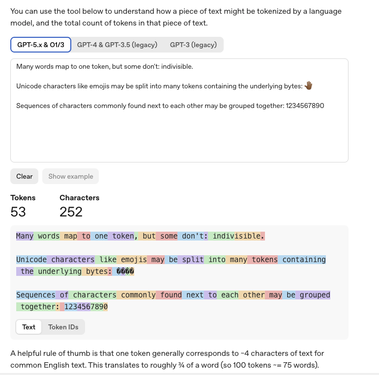
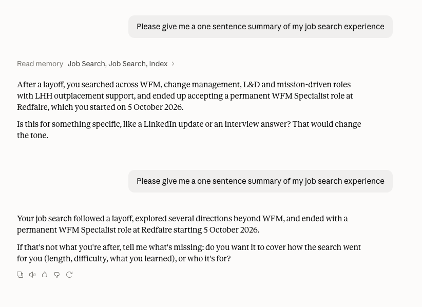

AI Foundations 101 task 1

* A token count: paste a sentence into a tokeniser (try the [OpenAI tokeniser](https://platform.openai.com/tokenizer)) and note the count.  
  * 53-57 tokens

* A context overflow you caused: a long chat or document where the model lost the start.  
  * I kept an ongoing chat over several days to work on my new CV when my role was made redundant.  At one point in time the chat generated a summary to inform itself as it went forward when I returned to the chat.  
* A temperature comparison: the same prompt giving different answers (or one run "be more creative").  
   
* A hallucination you spotted in the wild, and which of the three signatures gave it away.

I can’t remember seeing a hallucination just now, so instead I’m going to talk about an issue with training data and cutoff date.  I have spend a lot of time with Claude lately around my job hunt.  It started with tweaking CVs, then expanded to reading job descriptions to speed up my filtering process, and then eventually I started asking Claude to search for the right kinds of roles for me that have been recently posted.    Several times, it returned with strong encouragement to apply for roles with specific companies, only the role was no longer open.   It must have used an outdated version of the internet in these searches.
